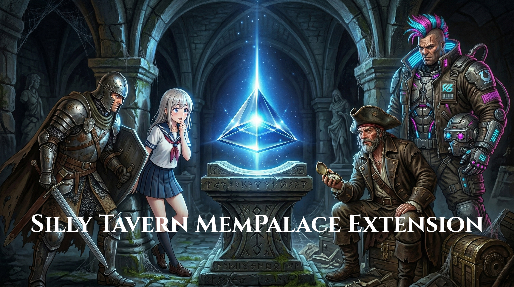

# Silly Tavern MemPalace Extension

> **Semantic long-term memory for SillyTavern characters.**
> Beyond keywords, MemPalace gives your AI characters a real, persistent, searchable memory built on vector embeddings and a knowledge graph.

[](https://github.com/ShinRalexis/Silly-Tavern-MemPalace-Extension/releases)
[](https://github.com/SillyTavern/SillyTavern)
[](https://github.com/milla-jovovich/mempalace)
[](LICENSE)

---

## What it does

SillyTavern's native memory is limited to a fixed context window. MemPalace replaces that with a full cognitive architecture:

- **Semantic RAG**: retrieves relevant memories based on meaning, not keywords
- **Knowledge Graph**: tracks facts, relationships and events as structured triples (Subject, Predicate, Object)
- **Memory Nucleus**: a permanent "core biography" always injected into the prompt
- **Lorebook ingestion**: teach entire lorebooks to a character once; they surface naturally during chat
- **AAAK compression**: compact memory encoding that saves up to 30x token space
- **Timeline**: chronological view of all recorded events for a character

---

## How it works

### Architecture

MemPalace operates as two components that work together:

```
SillyTavern (browser)              MemPalace Server (localhost:8052)
+---------------------+            +------------------------------+
|  extension/index.js |            |  bridge.py  (FastAPI)        |
|                     |  HTTP/JSON |  mcp_server.py  (~25 tools)  |
|  Generate           |<---------->|                              |
|  Interceptor        |            |  ChromaDB  (vector search)   |
|                     |            |  SQLite KG (fact triples)    |
|  UI Panel           |            |  Diary     (permanent notes) |
+---------------------+            +------------------------------+
```

Every time the AI is about to generate a response, the **generate interceptor** fires synchronously, queries the server, retrieves relevant memories, and injects them into the prompt before the LLM sees it.

### Memory Layers

Each character owns a **Wing** (an isolated memory namespace). Inside each wing, memories are stored in typed **Rooms**:

| Room | Content | Injected in prompt |
|---|---|---|
| `lore` | Lorebook entries, world facts, Oracle twists | Yes, with cooldown rotation |
| `char` | AI responses, Judgement outcomes | Yes, episodic retrieval |
| `user` | User messages | Yes, context anchoring |
| `secret` | Hidden facts | Never, KG only |

### Hexa-Phasic+ Retrieval Pipeline

On every AI generation, up to **6 parallel queries** are fired against the server:

| Phase | Query | Purpose |
|---|---|---|
| **A**: Lore | Semantic core of current message | Encyclopedic world knowledge |
| **B**: Plot | Narrative arc of last 4 messages | Recent story momentum |
| **C**: Echo | Semantic core + emotional boost | Personal character memories |
| **D**: KG | Up to 3 named entities from message | Structured fact retrieval |
| **E**: Neighbors | Character's social graph (depth 2) | Relationship context |
| **F**: KG Bridge | Objects/predicates from Phase D facts | Associative chaining |

Each phase has an independent `.catch()`, a failing phase never blocks the others. Results are merged, deduplicated, sorted by **freshness** (fragments not seen recently surface first), and compressed to fit within the configured token budget.

### Knowledge Graph

Every message is parsed for named entities and fact triples. Facts are stored as:

```
Subject, Predicate, Object
"Character Name", "works_at", "Seventh Heaven"
"Character Name", "knows", "Friend"
```

The KG feeds Phase D (direct facts), Phase E (relationship graph), and Phase F (associative bridge queries). It also powers the **Timeline**, **Entity Registry**, and **Synaptic Map** visualizations.

### AAAK Dialect

AAAK is an optional semantic compression protocol. Instead of injecting full sentences, memories are encoded as compact tokens:

```
[E:SAD][ID:CN][F:MISS_FATHER][T:past][R:high]
```

This reduces token usage by up to 30x while preserving semantic meaning. The character's personal AAAK dialect is generated once per wing and cached for the session.

### Memory Isolation Modes

| Mode | Wing key | Behaviour |
|---|---|---|
| **Global** | `Character_Name` | All chats share one memory, historical continuity across sessions |
| **Isolated** | `Character_Name_chat_chatId` | Each chat has its own memory, ideal for parallel storylines or "What If" scenarios |

---

## Requirements

- [SillyTavern](https://github.com/SillyTavern/SillyTavern)
- **Docker Desktop** (recommended) or **Python 3.11+**
- Git

---

## Installation

Clone the repo anywhere on your PC and run the installer:

```powershell
git clone https://github.com/ShinRalexis/Silly-Tavern-MemPalace-Extension
cd Silly-Tavern-MemPalace-Extension
.\install.ps1
```

The installer will:

1. **Detect SillyTavern** automatically (or ask you for the path)
2. **Install the extension** into your SillyTavern extensions folder
3. **Set up the server**: Docker or Python direct, your choice
4. **Create `Documents\MemPalaceMemories`**: all memories saved on your PC, never inside the container

At the end, both the extension and the server are fully working.

> **Already have MemPalace installed?**
> The script detects your existing container and updates the server files without touching your memories.

> [!WARNING]
> **Disable SillyTavern's built-in Vector Storage before using MemPalace!**
> Both systems manage AI memory and running them together causes conflicts. Go to Extensions > Vector Storage and disable it. MemPalace is designed to replace it entirely.

---

## Updating

```powershell
cd Silly-Tavern-MemPalace-Extension
git pull
.\install.ps1 -Update
```

This updates both the extension and the server in one step.

**Reconfigure paths:**

```powershell
.\install.ps1 -Configure
```

---

## Where memories are stored

On first install, the script creates:

```
Documents\
+-- MemPalaceMemories\
    +-- data\      <- ChromaDB vectors (semantic memories)
    +-- config\    <- Knowledge Graph SQLite + settings
```

Your memories live on your PC. The Docker container can be deleted and recreated without losing anything.

---

## Configuration

| Setting | Description |
|---|---|
| Memory Isolation | **Global** (all chats) or **Isolated** (per chat session) |
| RAG Relevance Threshold | 0.0 = retrieve everything / 1.0 = strict matches only |
| RAG Budget | Max characters injected per generation (default: 2000) |
| Max chars/fragment | Maximum length per individual memory fragment |
| AAAK Compression | Compact token encoding, recommended for long sessions |
| Auto-scan | Automatically sync new messages to memory on character load |

---

## Lorebook Ingestion

1. Extensions -> MemPalace -> **Lorebook Ingestion**
2. Select a lorebook from the dropdown
3. Click **Ingest Lore** (confirm twice)

All entries are ingested: `{{char}}` expands to the character name, `{{user}}` becomes `you`. Only entries explicitly tagged `[NO-RAG]` are skipped. This is intentional, broad ingestion at storage time, precise retrieval at generation time via semantic search.

---

## Memory Nucleus (Diary)

The **Nucleus** is a permanent text block always injected into the prompt, regardless of semantic relevance. Use it for:

- Fixed biographical facts (name, age, relationships)
- Traumas or defining events that should always be active
- Story rules that must never be forgotten

The Nucleus can be edited manually, loaded from a `.txt` file, or pre-populated from the Knowledge Graph via **Generate from KG**.

An **Auto-diary** runs every 20 generations, it summarizes the top KG facts and appends them to the Nucleus automatically.

---

## Knowledge Browser

Accessible from the MemPalace panel:

- **Timeline**: chronological events extracted from the KG, sorted by date
- **Entity Registry**: all known entities and their associated facts
- **Deep Scan**: full historical analysis of the entire chat, batch-processed
- **Synaptic Map**: interactive force-directed graph of all entities and relationships (powered by vis-network)

---

## Backup & Restore

**Export** exports a complete snapshot:

```json
{
  "palace_export_version": "2.0",
  "wing": "Character_Name",
  "drawers": { "total": 450, "items": [] },
  "kg": { "facts": [] },
  "diary": { "entries": [] }
}
```

**Restore** imports this snapshot. Supports both v1 (flat array) and v2.0 (object with metadata) formats.

---

## Integration with Silly Quantum

MemPalace integrates with [Silly Quantum](https://github.com/ShinRalexis/SillyQuantum) via a shared bridge (`window.__sillybridge`):

| Direction | Event | Effect |
|---|---|---|
| SQ -> MP | Chaotic quantum state (`111xxx`/`110xxx`) | +1 personal memory fragment per generation |
| SQ -> MP | Oracle twist generated | Saved to character's `lore` room automatically |
| SQ -> MP | Judgement outcome | Saved to character's `char` room automatically |
| MP -> SQ | RAG injection active | SQ reads MP bridge for cross-extension state |

The bridge is order-of-load independent, whichever extension loads first creates the shared object and the second one attaches to it.

---

## Repository Structure

```
Silly-Tavern-MemPalace-Extension/
+-- install.ps1        <- installer and updater (run this)
+-- README.md
+-- LICENSE
+-- extension/         <- SillyTavern extension (copied to ST/extensions/MemPlace/)
|   +-- index.js       <- main logic: interceptor, RAG pipeline, UI, KG browser
|   +-- manifest.json  <- ST extension manifest
|   +-- style.css      <- UI styles
|   +-- index.html     <- settings panel
|   +-- vis-network.min.js
+-- server/            <- Python backend (run via Docker or directly)
    +-- bridge.py      <- FastAPI server (POST /call/{tool_name})
    +-- mcp_server.py  <- ~25 MCP tools (search, add, wipe, KG, diary...)
    +-- knowledge_graph.py  <- SQLite KG: extract, store, query triples
    +-- dialect.py     <- AAAK compression engine
    +-- searcher.py    <- ChromaDB semantic search wrapper
    +-- config.py      <- configuration (env vars > config file > defaults)
    +-- docker-compose.yml
    +-- Dockerfile
    +-- requirements.txt
```

---

## Privacy

All data is stored **locally on your machine** in `Documents\MemPalaceMemories`. The server runs entirely offline. Nothing is sent to external services.

---

## License

MIT License, see [LICENSE](LICENSE)

---

## Acknowledgements

The server backend (`server/`) is built on the [MemPalace](https://github.com/milla-jovovich/mempalace) Python library by MemPalace Contributors, released under the MIT License.

The SillyTavern extension (`extension/`), the FastAPI bridge (`server/bridge.py`) and the installer (`install.ps1`) are original work by [ShinRalexis](https://github.com/ShinRalexis).

---

*Made by [ShinRalexis](https://github.com/ShinRalexis)*

---

If you use Silly-Tavern-MemPalace-Extension regularly, consider supporting development. It helps keep the project alive and motivates new features.

<a href="https://mempool.space/it/address/179gN4aknE1R53w2yNJpiE4sp7nDucZ1He"> 179gN4aknE1R53w2yNJpiE4sp7nDucZ1He</a>

<a href="https://liberapay.com/MetaDarko/donate"></a>
